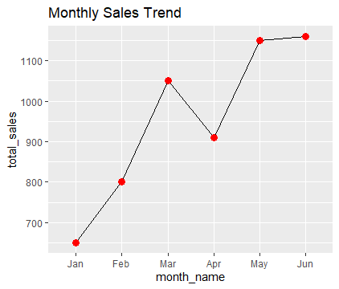
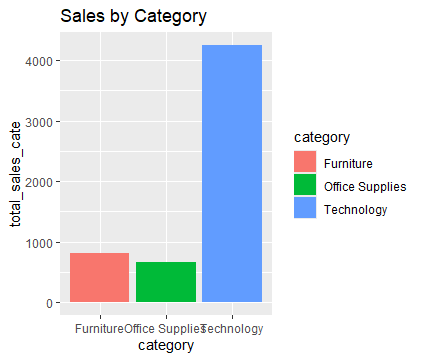

# Project Title 
E-Commerce_Sales_Trend_Analysis

# Project Overview
This project analyzes e-commerce sales data to identify the best-performing months, product category trends, and overall sales patterns over time. The dataset required data cleaning, including converting the order_date from character to date format before analysis.

# Tools Used
•	R
•	dplyr: For data manipulation
•	tidyr: For data reshaping 
•	lubridate: For date handling
•	ggplot2: For data visualization

# Data Description 
The dataset simulates e-commerce sales data, containing information such as order ID, order date, product category, and sales values.
The dataset contains 4 variables and 12 rows:
•	order_id: Unique identifier for each order
•	order_date: Date when the order was made
•	category: Type of product (e.g., Furniture, Technology, Office Supplies)
•	sales: Total revenue generated from each order

# Data Cleaning
The dataset required cleaning before analysis, particularly converting the order_date from character to a proper date format.
Data cleaning steps included: 
•	Converting order_date to date format using a lubridate function
•	Creating new columns: year, month, and month_name
•	Aggregating total sales per month

# Business Questions
•	Which month performed best?
•	Which category generated the most sales?
•	How did sales change over time?

# Key Insights 
•	June recorded the highest sales (1160), making it the best-performing month
•	Technology generated the highest revenue among all categories 
•	Sales declined from January and dropped significantly in April, before steadily increasing and peaking in June.

# Visualization
Charts were created using ggplot2 to show:
•	Monthly sales trend 

•	Sales by category

# Conclusion
This analysis shows how data cleaning and exploratory analysis can uncover important business insights. The results indicate that June had the highest sales, while Technology was the top-performing category, making them key drivers of revenue in this dataset. 
